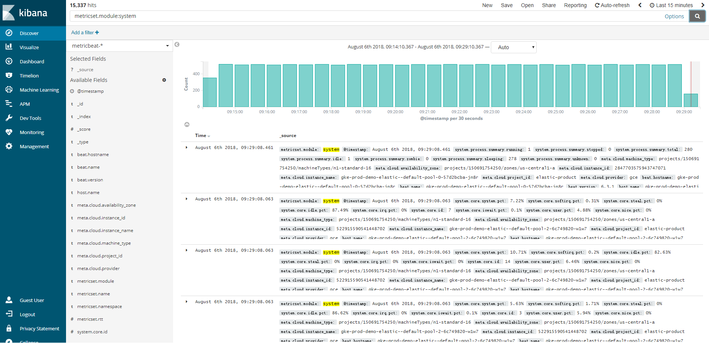
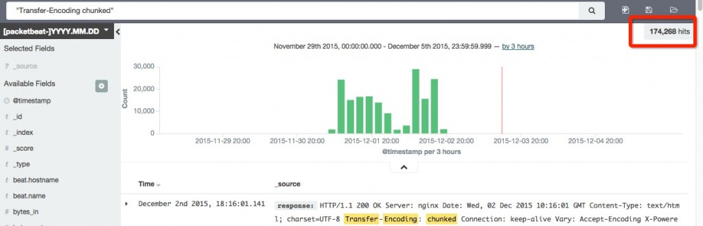
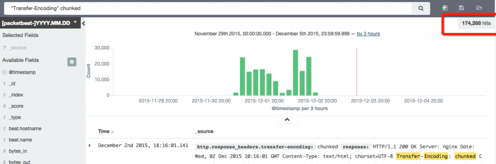
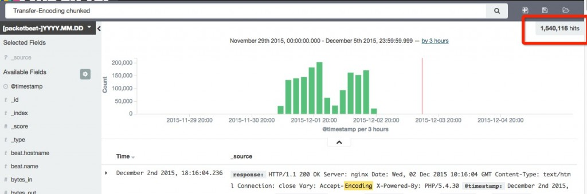
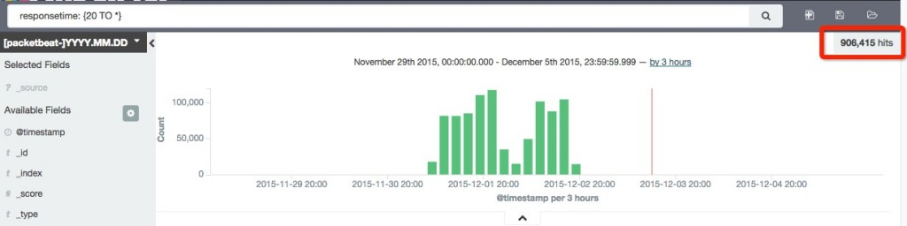
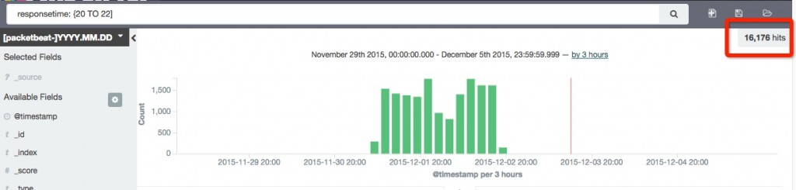
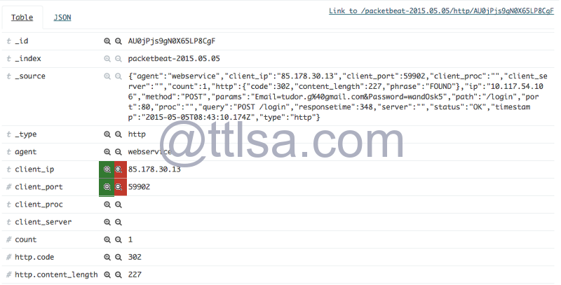
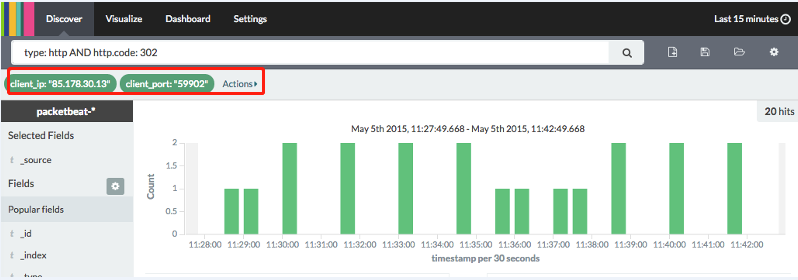

# ELk:Kibana查询/lucene查询语法

Kibana在ELK中扮演着数据可视化角色，用来查询及展示数据； Elasticsearch查询采用的是luncene搜索引擎，其4过滤查询语法和lucene一致。



[Kibana官方在线演示](http://demo.elastic.co/app/kibana#/discover)

在kibana中，可通过搜索查询过滤事务或者在visualization界面点击元素过滤。 


## 字段搜索

Lucene支持实时数据。执行搜索时，您可以指定字段，也可以使用默认字段。字段名称和默认字段是特定于实现的。

```
限定字段全文搜索：field:value
精确搜索：关键字加上双引号 filed:"value"
http.code:404 #搜索http状态码为404的文档
```

字段本身是否存在

```
_exists_:http  #返回结果中需要有http字段
_missing_:http #不能含有http字段
```

### 字符串查询

查询可以包含一个或多个字或者短语,短语最好使用双引号引起来。

要搜索一个确切的字符串，需要使用双引号引起来。如：

```
content:"jakarta apache"
```

如果不带引号，将会匹配每个单词。 

```
content:jakarta apache
```

 kibana会忽略特殊字符。 如 - ， 特殊字符要做转义。





## 通配符搜索

Lucene支持单个术语内的单个和多个字符通配符搜索（不在短语查询中）。

```
? 匹配单个字符
* 匹配0到多个字符
te?t,test*,te*t
```

注意：您不能使用*或？符号作为搜索的第一个字符。

## 正则表达式搜索

Lucene支持正向表达式搜索.

```
name:/joh?n(ath[oa]n)/
content:tex* #可以匹配到 text
```

## 模糊搜索

```
quikc~ brwn~ foks~
~:在一个单词后面加上~启用模糊搜索，可以搜到一些拼写错误的单词
first~ 这种也能匹配到 frist
```

还可以设置编辑距离（整数），指定需要多少相似度

```
cromm~1 会匹配到 from 和 chrome
默认2，越大越接近搜索的原始值，设置为1基本能搜到80%拼写错误的单词
```

## 近似搜索

在短语后面加上~，可以搜到被隔开或顺序不同的单词

```
"where select"~5 表示 select 和 where 中间可以隔着5个单词，可以搜到 select password from users where id=1
```

## 范围搜索

数值/时间/IP/字符串 类型的字段可以对某一范围进行查询

```
length:[100 TO 200]
sip:["172.24.20.110" TO "172.24.20.140"]
date:{"now-6h" TO "now"}
tag:{b TO e} 搜索b到e中间的字符
count:[10 TO *] * 表示一端不限制范围
count:[1 TO 5} [ ] 表示端点数值包含在范围内，{ } 表示端点数值不包含在范围内，可以混合使用，此语句为1到5，包括1，不包括5
可以简化成以下写法：
age:>10
age:<=10
age:(>=10 AND <20)
```






## 优先级

使用^使一个词语比另一个搜索优先级更高，默认为1，可以为0~1之间的浮点数，来降低优先级

```
quick^2 fox
```

## 布尔运算符搜索

布尔运算符允许通过逻辑运算符组合术语。Lucene支持AND，“+”，OR，NOT和“ - ”作为布尔运算符（注意：布尔运算符必须是大写）。

OR

```
"jakarta apache" jakarta
或者(两者等价)
"jakarta apache" OR jakarta
```

AND

```
"jakarta apache" AND "Apache Lucene"
mysql.method: SELECT AND mysql.size: [10000 TO *]
(mysql.method: INSERT OR mysql.method: UPDATE) AND responsetime: [30 TO *]
```

+:搜索结果中必须包含此项

```
+jakarta lucene
```

NOT

```
NOT "jakarta apache"
NOT type: mysql
```

-：不能含有此项

```
"jakarta apache" -"Apache Lucene"
```

注意：

在构造搜索表达式的时候你可以使用+(与AND相当,当不完全相同) 和空格(与OR相当),也可以使用AND和OR,
当然也可以都混在一起,个人感觉最好不要

构造复杂的表达式的时候千万要注意,特别是使用AND OR的时候,搜索引擎解析表达式的时候并非按照常规的
先AND后OR
比如
`tag:a AND  tag:b  OR  title:a  AND  title:b` 初看下来以为这个表达式与下面的等价
`(tag:a AND  tag:b ) OR  (title:a  AND  title:b)`
其实不是  `tag:a AND  tag:b  OR  title:a  AND  title:b`  与 `+tag:a +tag:b  + title:a  +title:b` 等价,也就是与下面的表达式等价:
`tag:a AND  tag:b  AND title:a  AND  title:b` ,所以你必须得加上括号

我倾向使用+和空格的组合,至少看上去更简单
上面的例子表示成 `(+tag:a +tag:b) (+title:a  +title:b)`

请注意 `+tag:a +tag:b` 和 `tag:a +tag:b` 的区别:
`tag:a +tag:b` 其实与 `tag:b` 或者 `+tag:b` 等价,你可以认为+是必须有的意思,没有+就是可有可无的意思,
所以通常一个独立的+没什么意思,多个+同时出现就和AND意义相当了

另外: `a AND b OR c` 也并不是你想的那个意思，`a AND b OR c`  等价 `+a +b c`  等价 `a AND b`

为了达到效果你不得不写成 `(a AND b) OR c`


## 分组搜索

Lucene支持使用括号将子句分组以形成子查询。如果要控制查询的布尔逻辑，这可能非常有用。

```
(jakarta OR apache) AND jakarta
```

## 字段分组搜索

Lucene支持使用括号将多个子句分组到单个字段。

```
title:(+return +"pink panther")
host:(baidu OR qq OR google) AND host:(com OR cn)
```

## 转义特殊字符搜索

Lucene支持转义属于查询语法的特殊字符。

```
+ - = && || > < ! ( ) { } [ ] ^ " ~ * ? : \ /
以上字符当作值搜索的时候需要用\转义
\(1\+1\)\=2用来查询(1+1)=2
```

### 创建过滤器

可通过单击可视化中的元素进行筛选。





绿色filter for value  红色filter out value。

# Grok patterns正则匹配示例

```javascript
USERNAME [a-zA-Z0-9._-]+
USER %{USERNAME}
EMAILLOCALPART [a-zA-Z][a-zA-Z0-9_.+-=:]+
EMAILADDRESS %{EMAILLOCALPART}@%{HOSTNAME}
INT (?:[+-]?(?:[0-9]+))
BASE10NUM (?<![0-9.+-])(?>[+-]?(?:(?:[0-9]+(?:\.[0-9]+)?)|(?:\.[0-9]+)))
NUMBER (?:%{BASE10NUM})
BASE16NUM (?<![0-9A-Fa-f])(?:[+-]?(?:0x)?(?:[0-9A-Fa-f]+))
BASE16FLOAT \b(?<![0-9A-Fa-f.])(?:[+-]?(?:0x)?(?:(?:[0-9A-Fa-f]+(?:\.[0-9A-Fa-f]*)?)|(?:\.[0-9A-Fa-f]+)))\b

POSINT \b(?:[1-9][0-9]*)\b
NONNEGINT \b(?:[0-9]+)\b
WORD \b\w+\b
NOTSPACE \S+
SPACE \s*
DATA .*?
GREEDYDATA .*
QUOTEDSTRING (?>(?<!\\)(?>"(?>\\.|[^\\"]+)+"|""|(?>'(?>\\.|[^\\']+)+')|''|(?>`(?>\\.|[^\`]+)+`)|``))
UUID [A-Fa-f0-9]{8}-(?:[A-Fa-f0-9]{4}-){3}[A-Fa-f0-9]{12}
# URN, allowing use of RFC 2141 section 2.3 reserved characters
URN urn:[0-9A-Za-z][0-9A-Za-z-]{0,31}:(?:%[0-9a-fA-F]{2}|[0-9A-Za-z()+,.:=@;$_!*'/?#-])+

# Networking
MAC (?:%{CISCOMAC}|%{WINDOWSMAC}|%{COMMONMAC})
CISCOMAC (?:(?:[A-Fa-f0-9]{4}\.){2}[A-Fa-f0-9]{4})
WINDOWSMAC (?:(?:[A-Fa-f0-9]{2}-){5}[A-Fa-f0-9]{2})
COMMONMAC (?:(?:[A-Fa-f0-9]{2}:){5}[A-Fa-f0-9]{2})
IPV6 ((([0-9A-Fa-f]{1,4}:){7}([0-9A-Fa-f]{1,4}|:))|(([0-9A-Fa-f]{1,4}:){6}(:[0-9A-Fa-f]{1,4}|((25[0-5]|2[0-4]\d|1\d\d|[1-9]?\d)(\.(25[0-5]|2[0-4]\d|1\d\d|[1-9]?\d)){3})|:))|(([0-9A-Fa-f]{1,4}:){5}(((:[0-9A-Fa-f]{1,4}){1,2})|:((25[0-5]|2[0-4]\d|1\d\d|[1-9]?\d)(\.(25[0-5]|2[0-4]\d|1\d\d|[1-9]?\d)){3})|:))|(([0-9A-Fa-f]{1,4}:){4}(((:[0-9A-Fa-f]{1,4}){1,3})|((:[0-9A-Fa-f]{1,4})?:((25[0-5]|2[0-4]\d|1\d\d|[1-9]?\d)(\.(25[0-5]|2[0-4]\d|1\d\d|[1-9]?\d)){3}))|:))|(([0-9A-Fa-f]{1,4}:){3}(((:[0-9A-Fa-f]{1,4}){1,4})|((:[0-9A-Fa-f]{1,4}){0,2}:((25[0-5]|2[0-4]\d|1\d\d|[1-9]?\d)(\.(25[0-5]|2[0-4]\d|1\d\d|[1-9]?\d)){3}))|:))|(([0-9A-Fa-f]{1,4}:){2}(((:[0-9A-Fa-f]{1,4}){1,5})|((:[0-9A-Fa-f]{1,4}){0,3}:((25[0-5]|2[0-4]\d|1\d\d|[1-9]?\d)(\.(25[0-5]|2[0-4]\d|1\d\d|[1-9]?\d)){3}))|:))|(([0-9A-Fa-f]{1,4}:){1}(((:[0-9A-Fa-f]{1,4}){1,6})|((:[0-9A-Fa-f]{1,4}){0,4}:((25[0-5]|2[0-4]\d|1\d\d|[1-9]?\d)(\.(25[0-5]|2[0-4]\d|1\d\d|[1-9]?\d)){3}))|:))|(:(((:[0-9A-Fa-f]{1,4}){1,7})|((:[0-9A-Fa-f]{1,4}){0,5}:((25[0-5]|2[0-4]\d|1\d\d|[1-9]?\d)(\.(25[0-5]|2[0-4]\d|1\d\d|[1-9]?\d)){3}))|:)))(%.+)?
IPV4 (?<![0-9])(?:(?:[0-1]?[0-9]{1,2}|2[0-4][0-9]|25[0-5])[.](?:[0-1]?[0-9]{1,2}|2[0-4][0-9]|25[0-5])[.](?:[0-1]?[0-9]{1,2}|2[0-4][0-9]|25[0-5])[.](?:[0-1]?[0-9]{1,2}|2[0-4][0-9]|25[0-5]))(?![0-9])
IP (?:%{IPV6}|%{IPV4})
HOSTNAME \b(?:[0-9A-Za-z][0-9A-Za-z-]{0,62})(?:\.(?:[0-9A-Za-z][0-9A-Za-z-]{0,62}))*(\.?|\b)
IPORHOST (?:%{IP}|%{HOSTNAME})
HOSTPORT %{IPORHOST}:%{POSINT}

# paths
PATH (?:%{UNIXPATH}|%{WINPATH})
UNIXPATH (/([\w_%!$@:.,+~-]+|\\.)*)+
TTY (?:/dev/(pts|tty([pq])?)(\w+)?/?(?:[0-9]+))
WINPATH (?>[A-Za-z]+:|\\)(?:\\[^\\?*]*)+
URIPROTO [A-Za-z]([A-Za-z0-9+\-.]+)+
URIHOST %{IPORHOST}(?::%{POSINT:port})?
# uripath comes loosely from RFC1738, but mostly from what Firefox
# doesn't turn into %XX
URIPATH (?:/[A-Za-z0-9$.+!*'(){},~:;=@#%&_\-]*)+
#URIPARAM \?(?:[A-Za-z0-9]+(?:=(?:[^&]*))?(?:&(?:[A-Za-z0-9]+(?:=(?:[^&]*))?)?)*)?
URIPARAM \?[A-Za-z0-9$.+!*'|(){},~@#%&/=:;_?\-\[\]<>]*
URIPATHPARAM %{URIPATH}(?:%{URIPARAM})?
URI %{URIPROTO}://(?:%{USER}(?::[^@]*)?@)?(?:%{URIHOST})?(?:%{URIPATHPARAM})?

# Months: January, Feb, 3, 03, 12, December
MONTH \b(?:[Jj]an(?:uary|uar)?|[Ff]eb(?:ruary|ruar)?|[Mm](?:a|ä)?r(?:ch|z)?|[Aa]pr(?:il)?|[Mm]a(?:y|i)?|[Jj]un(?:e|i)?|[Jj]ul(?:y)?|[Aa]ug(?:ust)?|[Ss]ep(?:tember)?|[Oo](?:c|k)?t(?:ober)?|[Nn]ov(?:ember)?|[Dd]e(?:c|z)(?:ember)?)\b
MONTHNUM (?:0?[1-9]|1[0-2])
MONTHNUM2 (?:0[1-9]|1[0-2])
MONTHDAY (?:(?:0[1-9])|(?:[12][0-9])|(?:3[01])|[1-9])

# Days: Monday, Tue, Thu, etc...
DAY (?:Mon(?:day)?|Tue(?:sday)?|Wed(?:nesday)?|Thu(?:rsday)?|Fri(?:day)?|Sat(?:urday)?|Sun(?:day)?)

# Years?
YEAR (?>\d\d){1,2}
HOUR (?:2[0123]|[01]?[0-9])
MINUTE (?:[0-5][0-9])
# '60' is a leap second in most time standards and thus is valid.
SECOND (?:(?:[0-5]?[0-9]|60)(?:[:.,][0-9]+)?)
TIME (?!<[0-9])%{HOUR}:%{MINUTE}(?::%{SECOND})(?![0-9])
# datestamp is YYYY/MM/DD-HH:MM:SS.UUUU (or something like it)
DATE_US %{MONTHNUM}[/-]%{MONTHDAY}[/-]%{YEAR}
DATE_EU %{MONTHDAY}[./-]%{MONTHNUM}[./-]%{YEAR}
ISO8601_TIMEZONE (?:Z|[+-]%{HOUR}(?::?%{MINUTE}))
ISO8601_SECOND (?:%{SECOND}|60)
TIMESTAMP_ISO8601 %{YEAR}-%{MONTHNUM}-%{MONTHDAY}[T ]%{HOUR}:?%{MINUTE}(?::?%{SECOND})?%{ISO8601_TIMEZONE}?
DATE %{DATE_US}|%{DATE_EU}
DATESTAMP %{DATE}[- ]%{TIME}
TZ (?:[APMCE][SD]T|UTC)
DATESTAMP_RFC822 %{DAY} %{MONTH} %{MONTHDAY} %{YEAR} %{TIME} %{TZ}
DATESTAMP_RFC2822 %{DAY}, %{MONTHDAY} %{MONTH} %{YEAR} %{TIME} %{ISO8601_TIMEZONE}
DATESTAMP_OTHER %{DAY} %{MONTH} %{MONTHDAY} %{TIME} %{TZ} %{YEAR}
DATESTAMP_EVENTLOG %{YEAR}%{MONTHNUM2}%{MONTHDAY}%{HOUR}%{MINUTE}%{SECOND}

# Syslog Dates: Month Day HH:MM:SS
SYSLOGTIMESTAMP %{MONTH} +%{MONTHDAY} %{TIME}
PROG [\x21-\x5a\x5c\x5e-\x7e]+
SYSLOGPROG %{PROG:program}(?:\[%{POSINT:pid}\])?
SYSLOGHOST %{IPORHOST}
SYSLOGFACILITY <%{NONNEGINT:facility}.%{NONNEGINT:priority}>
HTTPDATE %{MONTHDAY}/%{MONTH}/%{YEAR}:%{TIME} %{INT}

# Shortcuts
QS %{QUOTEDSTRING}

# Log formats
SYSLOGBASE %{SYSLOGTIMESTAMP:timestamp} (?:%{SYSLOGFACILITY} )?%{SYSLOGHOST:logsource} %{SYSLOGPROG}:

# Log Levels
LOGLEVEL ([Aa]lert|ALERT|[Tt]race|TRACE|[Dd]ebug|DEBUG|[Nn]otice|NOTICE|[Ii]nfo|INFO|[Ww]arn?(?:ing)?|WARN?(?:ING)?|[Ee]rr?(?:or)?|ERR?(?:OR)?|[Cc]rit?(?:ical)?|CRIT?(?:ICAL)?|[Ff]atal|FATAL|[Ss]evere|SEVERE|EMERG(?:ENCY)?|[Ee]merg(?:ency)?)
```

# 参考

1. [lucene查询语法，适用于ELk：kibana查询](https://owelinux.github.io/2018/08/03/article11-linux-luncene/)
2. [ELK kibana查询与过滤(17th)](http://www.ttlsa.com/elk/elk-kibana-query-and-filter/)
3. https://lucene.apache.org/core/5_2_0/queryparser/org/apache/lucene/queryparser/classic/package-summary.html
4. https://www.elastic.co/guide/en/elasticsearch/reference/current/query-dsl-query-string-query.html#query-string-syntax
5. https://segmentfault.com/a/1190000002972420#articleHeader10
6. [小议lucene搜索表达式中的AND和OR以及+和空格](https://blog.csdn.net/pwlazy/article/details/1530225?utm_source=blogxgwz3)
