# MySQL 索引的使用


## 什么是索引？

假设我们有一张数据表 employee(员工表)，该表有三个字段（列）,分别是name、age 和address。假设表employee有上万行数据，现在需要从这个表中查找出所有名字是‘ZhangSan’的雇员信息，你会快速的写出SQL语句：

```
select name,age,address from employee where name='ZhangSan'
```

如果数据库还没有索引这个东西，一旦我们运行这个SQL查询，查找名字为ZhangSan的雇员的过程中，究竟会发生什么？数据库不得不在employee表中的每一行查找并确定雇员的名字（name）是否为‘ZhangSan’。

由于我们想要得到每一个名字为ZhangSan的雇员信息，在查询到第一个符合条件的行后，不能停止查询，因为可能还有其他符合条件的行，所以必须一行一行的查找直到最后一行——这就意味数据库不得不检查上万行数据才能找到所有名字为ZhangSan的雇员。这就是所谓的全表扫描，显然这种模式效率太慢，技术可能觉得无所谓，业务会拿刀砍你。

你会想为如此简单的事情做全表扫描效率欠佳——数据库是不是应该更聪明一点呢？这就像用人眼从头到尾浏览整张表，很慢也不优雅，“索引”派上用场的时候到了，使用索引的全部意义就是：通过缩小一张表中需要查询的记录/行的数目来加快搜索的速度。

在关系型数据库中，索引是一种单独的、物理的对数据库表中一列或多列的值进行排序的一种存储结构，它是某个表中一列或若干列值的集合和相应的指向表中物理标识这些值的数据页的逻辑指针清单。大白话意思是索引的作用相当于图书的目录，可以根据目录中的页码快速找到所需的内容。

一个索引是存储的表中一个特定列的值数据结构。索引是在表的列上创建。要记住的关键点是索引包含一个表中列的值，并且这些值存储在一个数据结构中。请牢记这一点：索引是一种数据结构。一个好的数据库表设计,从一开始就应该考虑添加索引,而不是到最后发现慢SQL了,影响业务了才来补救。其实我在工作经历当中，由于新建表或新加字段后,忘记添加索引也造成了多次生产事故,记忆犹新!!!


在没有GUI工具的情况下，可以使用以下命令查看索引：

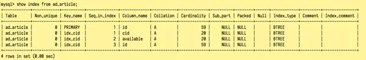


上述 ad_article 表中有两个索引，Key_name 中有显示:

- PRIMARY 主键索引，Seq_in_index 索引序号为1，从1开始，Collation为“A”表示升序（或NULL无分类），对应字段是id
- idx_cid是自建索引，由cid、available、id三个字段组成，分别对应序号1,2,3

表中大部分信息都挺好理解的，倒是Index_type=BTREE这块内容很多人不懂其意思，其实通过GUI工具创建索引时也会有BTREE 的显示，先着重了解一下。

## BTREE

在计算机数据结构体系中，为了加速查找的速度，常见的数据结构有两种：

- Hash哈希结构，例如Java中的HashMap，这种数据组织结构可以让查询/插入/修改/删除的平均时间复杂度都为O(1);
- Tree 树 结构 ， 这种数据组织结构可以让查询/插入/修改/删除的平均时间复杂度都为O(log(n));

注：时间复杂度O是数据结构课程中的基础内容，不明白同学的自行充电。O(1)的意思是不管N多大其速度都是恒定的，O(log(N))的意思是不管N多大，都要花费N的对数次时间。

问题来了：即然不管读还是写，Hash这种类型比Tree树这种类型都要更快一些，那为什么MySQL的开发者既使用Hash类型做为索引，又使用了BTREE呢？

话说回来，还是跟SQL应用场景有关系，前文中我们找"ZhangSan"用户的SQL：

```
select name,age,address from employee where name='ZhangSan'
```

确实用HASH索引更快，因为每次都只查询一条信息（重名的雇员姓名也才几条而已），但实际上业务对于SQL的应用场景是：

- orderby 需要排个序
- groupby 还要分个组
- 还要比较大小 大于或小于等等

这种情况下如果继续用HASH类型做索引结构，其时间复杂度会从O(1)直接退化为O(n)，相当于全表扫描了，而Tree的特性保证了不管是哪种操作，依然能够保持O(log(n))的高效率，有种我自岿然不动的赶脚！所以抛开应用场景谈设计其实是耍流浪（比如很多java程序员被安利阿里的fastjson比jackson快，故而抛弃jackson一样），实际上MySQL中也支持HASH类型的索引，但不是主流。


那MySQL中的BTREE和TREE又有啥联系与区别呢？先来看看传统的二叉树：

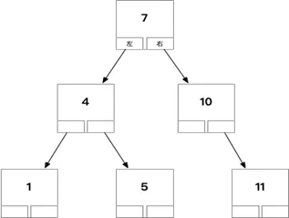

二叉树是大家熟知的一种树，用它来做索引行不行，可以是可以，但有几个问题：

- 如果索引数据很多，树的层次会很高（只有左右两个子节点），数据量大时查询还是会慢
- 二叉树每个节点只存储一个记录，一次查询在树上找的时候花费磁盘IO次数较多

所以它并不适合直接拿来做索引存储，算法设计人员在二叉树的基础之上进行了变种，引入了BTREE的概念（详情可自行查询）

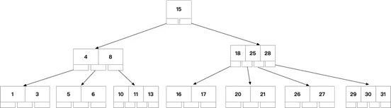

如上图可知BTREE有以下特点：

- 不再是二叉搜索，而是N叉搜索，树的高度会降低，查询快
- 叶子节点，非叶子节点，都可以存储数据，且可以存储多个数据
- 通过中序遍历，可以访问树上所有节点

BTREE被作为实现索引的数据结构被创造出来，是因为它能够完美的利用“局部性原理”，其设计逻辑是这样的：

- 内存读写快，磁盘读写慢，而且慢很多
- 磁盘预读：磁盘读写并不是按需读取，而是按页预读，一次会读一页的数据，每次加载一些看起来是冗余的数据，如果未来要读取的数据就在这一页中，可以避免未来的磁盘读写，提高效率（通常，一页数据是4K）
- 局部性原理：软件设计要尽量遵循“数据读取集中”与“使用到一个数据，大概率会使用其附近的数据”，这样磁盘预读能充分提高磁盘IO效能

早先的MySQL就是使用的BTREE做为索引的数据结构，随着时间推移，B树发生了较多的变种，其中最常见的就是B+TREE变种，现在MySQL用的就是这种，示意如下：

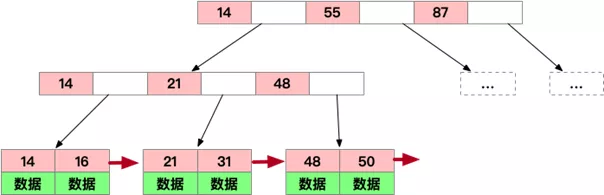

B+TREE改进点及优势所在：

- 仍然是N叉树，层级小，非叶子节点不再存储数据，数据只存储在同一层的叶子节点上，B+树从根到每一个节点的路径长度一样，而B树不是这样
- 叶子之间，增加了链表(图中红色箭头指向)，获取所有节点，不再需要中序遍历，使用链表的next节点就可以快速访问到
- 范围查找方面，当定位min与max之后，中间叶子节点，就是结果集，不用中序回溯（范围查询在SQL中用得很多，这是B+树比B树最大的优势）
- 叶子节点存储实际记录行，记录行相对比较紧密的存储，适合大数据量磁盘存储；非叶子节点存储记录的PK，用于查询加速，适合内存存储
- 非叶子节点，不存储实际记录，而只存储记录的KEY的话，那么在相同内存的情况下，B+树能够存储更多索引

可以来初步计算一下：假设key、子树节点指针均占用4B，则B树一个节点占用4 + 4 = 8B，一页页面大小4KB，则N = 4 * 1024 / 8B = 512，一个512叉的B树，1000w的数据，深度最大 log(512/2)(10^7) 约等于3。对比二叉树如AVL的深度为log(2)(10^7) 约为24，相差了8倍！

假如一个节点大小是4KB，一个KEY有8字节，一页可以存4000/8=500个KEY，根据N叉树特点,就算一层500叉节点，则：

- 第一层树：1个节点，1*500KEY , 大小4K
- 第二层树：500节点 500*500=25万个KEY，500*4K=2M
- 第三层树：500 * 500节点 500*500*500=1.2亿KEY，500*500*4K=1G

如果没算错，1G空间，只用三层树结构，可以存1.2亿行数据的KEY，B+树牛掰不？

所以B+TREE索引只用占用很少的内存空间，却大大提升了查询效率（不论是单个查询、范围查询还是有序性查询），并且还减少了磁盘读写，所以好的算法与数据结构是可以省钱的。

说完BTREE，在 `showindex from ad_article` 结果集中有一列为Cardinality的值，它的作用也非常的大，称之为：索引基数

## Cardinality 索引基数

索引基数简单的说就是:你索引列的唯一值的个数，如果是复合索引就是唯一组合的个数。这个数值将会作为MySQL优化器对语句执行计划进行判定时依据。如果唯一性太小，那么优化器会认为这个索引对语句没有太大帮助，而不使用索引。cardinality值越大，就意味着，使用索引能排除越多的数据，执行也更为高效。

举个简单例子来说明：比如有一张表有A、B、C列，数据情况如下：

```
A B C
1 1 1
1 1 2
1 2 1
1 2 2
2 1 1
2 1 2
2 2 1
2 2 2
```

- 如果对A列进行索引，那么它的cardinality基数值为2，因为只有1，2两种值
- 如果对A、B两列做复合索引，那么它的cardinality基数值为4，因为值的组合为(1 1),(1 2),(2 1),(2 2)
- 如果对A、B、C做复合索引，则它的cardinality基数值为8

当有多个索引可用时，mysql会自动依据cardinality大的值来进行SQL索引选择优化。如果现在再问你“为什么数据库都有PK”，你怎么答?因为PK的数据均不一样啊，做索引了后查询起来效果才快啊，因为cardinality值很高，是不是？另一种问法常见于判断题，问你“数据库索引通常要放在选择性差的列上”，你以前可能还不明白为什么，其背后逻辑就是索引的cardinality值啊，选择性差意味着重复数据少，索引才高效嘛。


但回到我们自己的例子，数据库中有数据值61行，但是cardinality=59并不准确，是因为它不会自动更新，需要通过analyzetable来进行更新，示例如下：

mysql>analyze local table ad_article;

优化以后结果为：

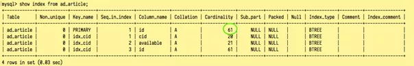

索引基数更加准确一些了。

## 索引类型

MySQL中有以下索引类型：

UNIQUE唯一索引 该索引其含义是被标定义唯一索引的列，不允许出现重复的数据， 但可以有NULL值。举例来讲,假如有A、B两个字段，建立唯一索引：

```
A B
1 1
1 2
1 1 // 这一行数据无法插入，因为与第一条数据重复，数据库底层报错DuplicateKeyException 1 1
```

唯一索引有利有弊，好处是：如果你的程序不好处理界面端的重复提交，或者因为数据的重复导致程序出错误，可以通过创建唯一索引来解决问题，当然不要为了设置唯一索引而设置索引，索引还是要有用处的。

其次在设置了唯一索引时，万一真要发生变更，支持重复数据怎么办?MySQL提供了两种补救办法：

- 自动替换为新的值，可以用 `ONDUPLICATE KEY UPDATE xxx= VALUES(xxx)`
- 忽略插入是 `insert ignore into`

INDEX 普通索引允许出现相同的索引内容，平时创建的索引通常就是普通索引，利用提升查询数据性能

PRIMARY KEY 主键索引 不允许出现相同的值,且不能为NULL值,一个表只能有一个primary_key索引，常见于ID字段

fulltext index 全文索引 上述三种索引都是针对列的值发挥作用,但全文索引,可以针对值中的某个单词,比如一篇文章中的某个词,然而并没有什么卵用,因为只有myisam引擎以及英文支持,并且效率让人不敢恭维,要全文搜索还是建议使用Luence、Solr、ES等方案，更专业且强大一些。

### 索引的创建与使用

```
ALTER TABLE 适用于表创建完毕之后再添加

ALTERTABLE 表名 ADD 索引类型 （unique,primary key,fulltext,index）[索引名]（字段名）

CREATE INDEX 可对表增加普通索引或UNIQUE索引

CREATE INDEX index_name ON table_name (column_list)

CREATE UNIQUE INDEX index_name ON table_name(column_list)
```

另外,还可以在建表时添加:

```
CREATE TABLE mytable (
 ... //中间字段忽略
 PRIMARY KEY (`id`),
 UNIQUE KEY `unique1`(`username`), -- 索引名称,可要可不要,不要就是和列名一样
 KEY `index1` (`nickname`),
 FULLTEXT KEY `intro` (`intro`)
) ENGINE=MyISAMAUTO_INCREMENT=4 DEFAULT CHARSET=utf8 COMMENT='测试表';
```

一张表字段有多有少，该在哪些列上创建索引呢？其实新建索引也是有一定的原则的,建什么索引,建在哪些字段上,有以下一些原则与技巧可参考：

- 在维度高或选择性差的列创建索引 说人话就是数据列中不重复值出现的个数,这个数量越高,维度就越高（如数据表中存在8行数据a,b ,c,d,a,b,c,d这个表的维度为4）。要为维度高的列创建索引,如性别和年龄,那年龄的维度就高于性别，性别这样的列不适合创建索引,因为维度过低，只有两三种值。
- 对 where,on,group by,order by 中出现的列使用索引，索引一般多设置在条件列上，显示列通常少设置索引
- 对较小的数据列使用索引 ,这样会使索引文件更小,同时内存中也可以装载更多的索引键，例如有一个字段存文本内容，新闻、资讯类那种的，内容超大，你为它设置索引就是脑袋被门夹了。
- 为较长的字符串使用前缀索引，比如有个姓名字段firstname，varchar(50)个长，可以用

alter table employee add key(firstname(5))

来设置前缀索引，为什么这里只取前5个字符进行索引呢？是因为可以通过

```
select 1.0 *count(distinct left(firstname,5)) / count(*) from employee
```

算法得到前几个字母对标数据的覆盖率，覆盖率超过31%黄金值就可以使用前缀索引。

- 使用组合索引,可以减少文件索引大小,在使用时速度要优于多个单列索引
- 索引也不是越多越好，不要过多创建索引,除了增加额外的磁盘空间外,对于DML操作的速度影响很大,因为其每增删改一次就得从新建立索引

说了创建索引，接下来就是使用索引，如果认真研读过前面的“执行计划”，SQL用到哪些索引，用了索引没有一目了然，但是有一些情况就是不会走索引，先来一些简单的示例说明：

```
SELECT sname FROM stu WHERE age+10=30; --不会使用索引,因为有索引列参与了计算

SELECT sname FROM stu WHERE LEFT(date,4) <1990; -- 不会使用索引,因为使用了函数运算,原理与上面相同

SELECT * FROM table WHERE uname LIKE'前缀%' -- 走索引

SELECT * FROM table WHERE uname LIKE "%关键字%"-- 不走索引

SELECT * FROM table WHERE a=1 -- a列为char字符类型，用整数找不走索引，a='1'才走索引

SELECT * FROM table WHEREdname='xxx' or loc='xx' or deptno=45
```

- 如果条件中有or,即使其中有条件带索引也不会使用。换言之,就是要求使用的所有字段,都必须建立索引,建议大家尽量避免使用or关键字
- 正则表达式,regexp不走索引
- 表中数据不多，只有几十几百条，MySQL评估使用全表扫描要比使用索引快,也不使用索引，不要大惊小怪

以上都是单表查询操作，多表关联查询才是业务开发的“常见姿势”，假如有一个查询：

```
select a,b,c from A join B join C on a=b and b=c;
```

三表join关联，假设三个表每个均有2000条记录，在没有添加索引时，则结果会进行2000*2000*2000=8000000000一共80亿次检索(因为一不小心就是一个笛卡尔乘积的恐怖扫描),只有在加了索引后，第一张表会全表扫描2000次，其余的关联表基本是range区间扫描，这样扫描次数就会降低很多很多，并且关联表时，建议多用leftjoin以少联多减少扫描次数。

有些时候发现明明创建了索引，但是因为一些原因并没有使用索引，mysql支持强制走索引,比如：

```
select* from table where a=1 force index(PRI，my_index) --强制主键索引和自己创建的索引
```

与之相反，还可以禁止某个索引：

```
select* from table where a=1 ignore index(PRI,my_index) --禁止使用索引
```

复合索引执行顺序

复合索引的执行顺序是有讲究的，还是以之前的案例举例：


表有一个主键索引及一个复合索引，复合索引名称：idx_cid，字段顺序分别是：cid,available及id

只用cid执行分析：

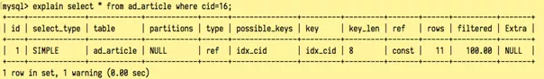

结果显示用到了idx_cid，接下来再看第二个字段的分析：

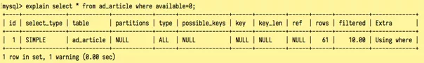

没有走idx_cid索引，全表扫描，接下来再看第三个的分析：

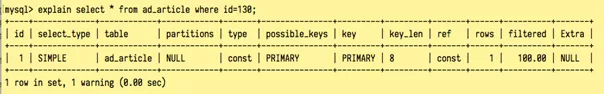

因为id本身就是主键，所以也不会走idx_cid索引，而是走主键索引，假设id不是主键索引，则也不会走idx_cid索引。

接下来再测试两两组合,先看cid +available组合：

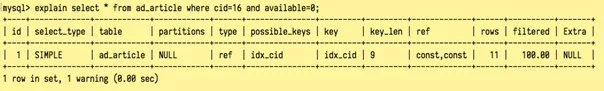

结果显示用到了idx_cid，再看cid+id组合：

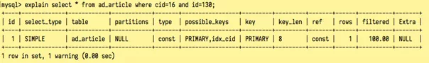

结果显示也用到了idx_cid，再看available+id组合：

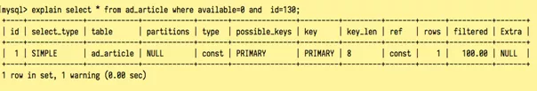

结果是走的主键索引，并没有走idx_cid复合索引，于是结果很清晰了，MySQL中的复合索引有顺序，且很重要，查询条件的顺序不能随意乱写。假设A、B、C三个字段索引按A+B+C顺序创建的索引：

A --走索引

B --不走索引

C --不走索引

A + B 或 B + A -- 走索引

B + C 或 C + B -- 不走索引

A + B + C 或 B + C + A 或 C + B + A --走索引

小结：在复合索引中，索引第一位的column很重要，只要查询语句包含了复合索引的第一个条件,基本上就会使用到该复合索引（可能会使用其他索引）。在建复合索引的时候应该按照column的重要性从左往右建。


# 索引的坑

既然索引这么好，我们是不是应该尽可能多用索引呢？并不是。

首先，不要盲目的创建索引，应只为那些查询操作频繁的列创建索引,创建索引会使查询操作变得更加快速,但是会降低增加、删除、更新操作的速度,因为执行这些操作的同时会对索引文件进行重新排序或更新。

其次，在互联网应用中,查询的语句远远大于DML的语句,为一个大表（比如千万级数据）新建索引时是一个需要特别慎重的事情，经常出现“翻车”导致“车毁人亡”的事故，为什么？因为线上系统在被人使用，如果这时候开发或者运维人员执行一个创建索引的语句，容易导致表被锁死，所有操作排队无法被响应，时间一长容易导致业务崩溃，形成链式连锁反应，让业务蒙受巨大损失。百万或千万级数据库，大表加索引有一个比较好的方法：online-schema-change，有兴趣可自行网上搜索，此文不再赘述。